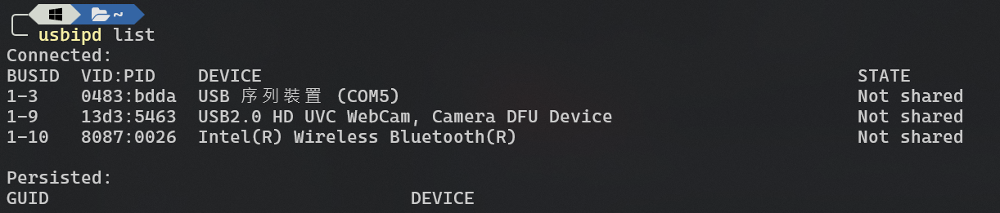
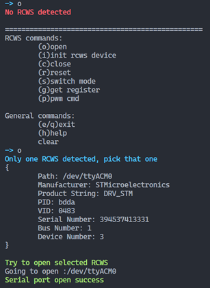
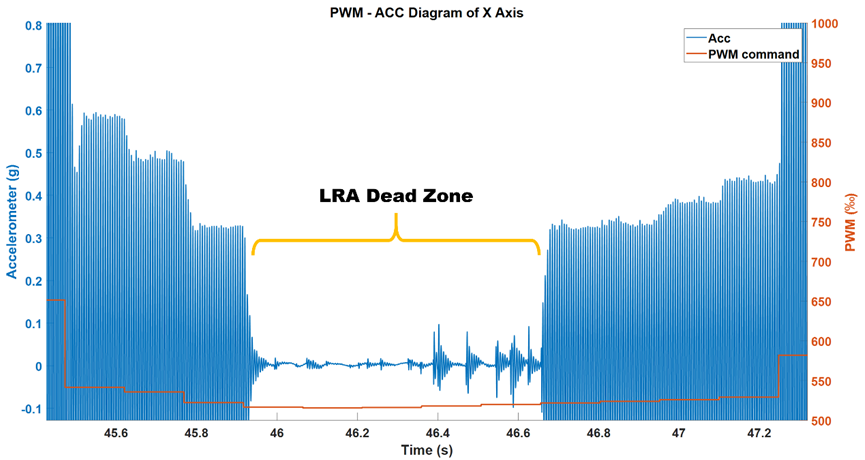
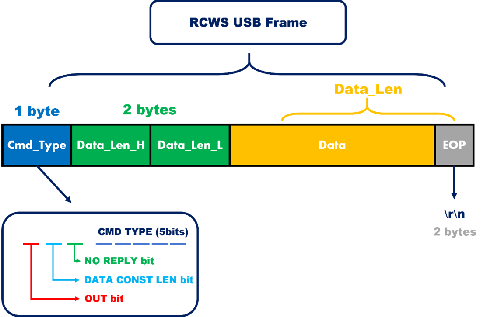

# RCWS Host

rcws_host is a collection of programs written in C++ that runs in Linux userspace to control the RCWS. Its functionalities include the RCWS driver (command encoder and decoder), CLI, and more, enabling users to control the behavior of the RCWS (e.g., tri-axis LRA vibration, etc.) via a command line interface and to receive returned data.

rcws_host interacts with [rcws_stm32_firmware](https://github.com/Dennis40816/rcws_stm32_firmware); please refer to that repository for further details.

## Third-Party Libraries

- [BS thread-pool](https://github.com/bshoshany/thread-pool)
- [spdlog](https://github.com/gabime/spdlog)
- [asio](https://github.com/chriskohlhoff/asio.git)
- [jsoncpp](https://github.com/open-source-parsers/jsoncpp.git)
- [websocketpp](https://github.com/zaphoyd/websocketpp.git)

## Folder Description

**rcws_host Main Program Location**  
Located at `test/usb_test/src/rcws_host`

**data**

- Automatically generated on the first run of `rcws_host`
- Stores accelerometer data and PWM command logs; see [Data Format](#data-format) for details.

**src**

- Used for controlling the RCWS in the Raspberry Pi version, now **deprecated**.

**test**

- Used for testing basic functionalities of RCWS such as USB communication.
- The latest version of the `rcws_host` main program is also located here.

**third_party**

- Contains third-party libraries.

## Build

### Clone

```bash
# git clone to local
git clone --recurse-submodules -j8 https://github.com/Dennis40816/rcws_host.git
cd rcws_host
```

### Environment Prerequisites

- OS
  - WSL (Ubuntu 22.04 or newer)
  - Ubuntu 22.04 or newer
- Compiler
  - g++-10
- Serial library
  - libserial-dev
- FFTW library
  - libfftw3-dev

```bash
### requirement

# compiler
sudo apt install g++-10

# fftw
sudo apt-get install libfftw3-dev
sudo apt install libserial-dev

### usb-lib
sudo apt-get install libudev-dev
sudo apt-get install libusb-1.0-0-dev

### optional
sudo apt-get install libboost-all-dev
```

> [!TIP]
> If you're using WSL2, keep going!

To run the rcws_host application on WSL2, you need to install [usbipd-win](https://github.com/dorssel/usbipd-win). As of March 24, 2025, version 5.0 has been released, and usbipd-win underwent major API updates in version 4.0. The following instructions assume that you are using version ≥ 4.0.

> Setup: Windows Terminal

Please execute the following command in PowerShell:

```
winget install usbipd
```

After installation, you can verify that the device is installed correctly by running:

```
usbipd list
```

You should see an output similar to the following:



> Setup: WSL2 Terminal

```bash
sudo apt install linux-tools-generic hwdata
sudo update-alternatives --install /usr/local/bin/usbip usbip /usr/lib/linux-tools/*-generic/usbip 20
```

> Attach RCWS to WSL2

Then, execute the following commands (you will need sudo privileges or to run the terminal with administrator rights):

- When binding (make USB device **SHARED**)

  ```bash
  sudo usbipd bind --busid <bus-id> # or
  sudo usbipd bind -b <bus-id>
  # e.g.,
  # sudo usbipd bind --busid 1-3
  # sudo usbipd bind -b 1-3
  ```

- When attaching to WSL2

  ```bash
  usbipd attach --wsl --busid=<bus-id>
  # e.g.,
  # usbipd attach --wsl --busid=1-3

  # you can use the -a flag to automatically re-attach
  # usbipd attach --wsl -a --busid=1-3
  ```

- When detaching from WSL2

  ```bash
  usbipd detach --wsl --busid=<bus-id>
  # e.g.,
  # usbipd detach --wsl --busid=1-3
  ```

- When unbinding

  ```bash
  sudo usbipd unbind --busid <bus-id>
  # e.g.,
  # sudo usbipd unbind --busid 1-3
  ```

Once the connection is successful, start the executable and press `o` — this should successfully open RCWS.



### Compile

```bash
# build
mkdir build && cd build
cmake ..
make
```

### Execute

```bash
./build/bin/rcws_host
```

[Watch on YouTube](https://youtu.be/ZvQ0uNaxThk)

[](https://youtu.be/ZvQ0uNaxThk)

## RCWS CLI Commands

|    Command     | Alias Char | Description                                                                                            |
| :------------: | :--------: | ------------------------------------------------------------------------------------------------------ |
|     `Open`     |    `o`     | Open the serial connection and establish connection with RCWS                                          |
|     `Init`     |    `i`     | Send an initialization string to RCWS to set it to a controllable state                                |
|    `Close`     |    `c`     | Close the RCWS serial connection if the connection is already established                              |
|    `Reset`     |    `r`     | Reset the specified IC (including MCU) to its default register value                                   |
| `Switch mode`  |    `s`     | Switch to a given state. Note that data mode allows RCWS to automatically send back accelerometer data |
| `Get register` |    `g`     | Retrieve a specific internal register from an IC (for debugging purposes)                              |
|   `PWM cmd`    |    `p`     | Send a PWM command to RCWS                                                                             |
|     `Exit`     | `e` / `q`  | Exit rcws_host                                                                                         |
|     `Help`     |    `h`     | Display available commands                                                                             |
|    `Clear`     |    `c`     | Clear the terminal                                                                                     |

### What is PWM cmd?

RCWS uses PWM to control the LRA driver IC, and RCWS receives messages in PWM cmd format to adjust the current PWM output.

The duty cycle of the PWM affects the output of the LRA driver. When the duty cycle is 100%, the LRA delivers its maximum positive output. Conversely, 0% corresponds to the maximum negative output; the difference is a 180-degree phase shift in the waveform. At 50%, there is no output.

We use fixed-point representation for the duty cycle; for instance, 500 represents a specific value.

The LRA has a dead zone, so when adjusting the duty cycle, it is recommended to avoid the range of 480 to 520. The dead zone is illustrated in the figure below.



## RCWS Message

RCWS is transmitted over USB as an RCWS Message, which consists of several fields:

- **Header**
  - **Cmd_Type**: indicates the command type of the message. The OUT bit within this field specifies whether the message is sent by the USB Host (rcws_host) or by the rcws module.
  - **Data_Len**: the length of the data (excluding the header).
- **Data Content**: the actual data.
- **EOP**: end of packet.



## RCWS Data Format

**Accelerometer Data**

This file stores data measured by the ADXL355 accelerometer at 4000 Hz. An example of the content is as follows:

```txt
9.731036, -0.0061, -0.0162, 0.9996
9.731281, -0.0060, -0.0164, 0.9997
9.731528, -0.0062, -0.0169, 0.9998
9.731774, -0.0067, -0.0166, 1.0000
9.732022, -0.0059, -0.0163, 1.0000
```

The first column represents the timestamp (in seconds) at which the RCWS module started; subsequent columns represent the x, y, and z accelerations (in units of g). The theoretical difference between consecutive timestamps is 250 microseconds.

**PWM Command (PWM cmd)**

This file logs the PWM commands sent to the RCWS. An example of the content is as follows:

```txt
48.501, 500, 5, 500, 5, 500, 5
```

The first column is the timestamp (in seconds) when the RCWS module started. The following columns represent the PWM command and vibration frequency for the x-axis, y-axis, and z-axis, respectively.

Note that the current vibration frequency parameter is reserved and will not be processed by the RCWS firmware; you may use 5.0 as the input value.

## Trouble Shooting

> Encounter `Bad file descriptor` when opening RCWS

If you encounter a `Bad file descriptor` error when opening ACM devices, please follow these instructions. The issue is caused by tty permissions. Check if the current user is in the `dialout` group. If not, execute:

```bash
sudo usermod -aG dialout <username>
```

Then log out and log back in or restart the system. This will permanently resolve the issue. As a temporary workaround, you can run the command with `sudo` to elevate permissions.

## Reference

- [Google Cpp Guide](https://google.github.io/styleguide/cppguide.html)
